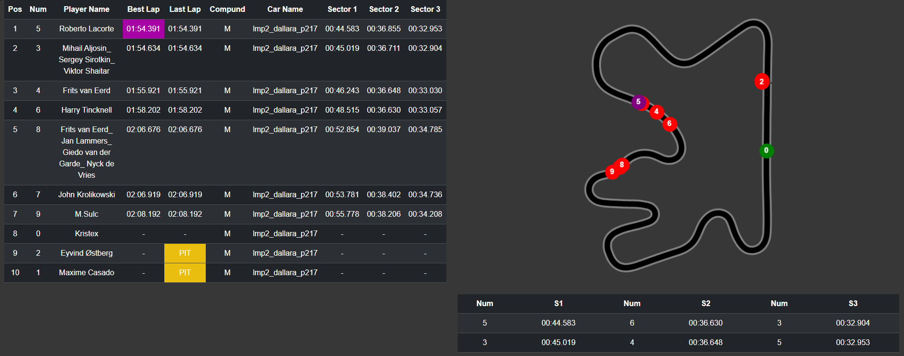

# Assetto Corsa Live Telemetry

A robust Java Spring Web server designed to interface with Assetto Corsa via a custom [AC Python App](https://github.com/Kristex95/assetto-corsa-live-telemetry-mod). This project bridges the gap between in-game telemetry and the web, providing a real-time dashboard for racing data.

## Requirements

- Java 21

## Installation and Run

- `mvn clean install -DskipTests`
- `mvn spring-boot:run`

## Access Webpage

- host:port/track | [default](http://localhost:8080/track)

## Screenshots

